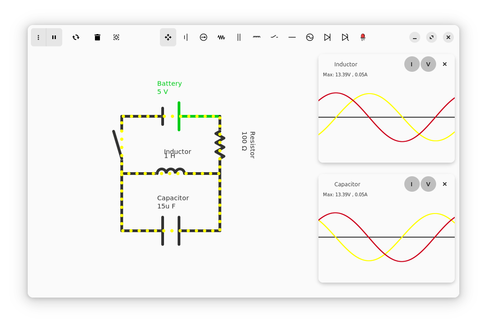
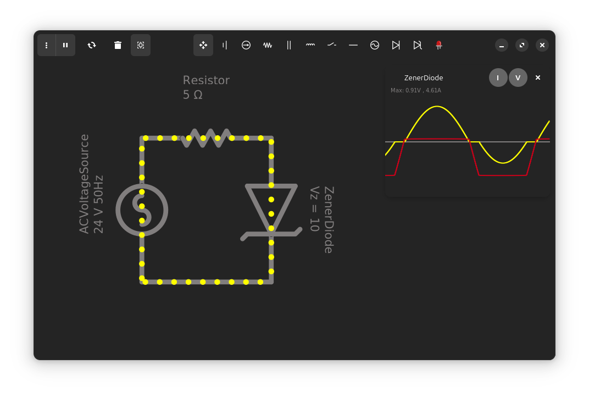

<a id="readme-top"></a>
<div align="center">
<a href="https://github.com/hamza-Algohary/Coulomb">
    
</a>
<h3 style="font-size:36px" align="center">Coulomb</h3>
<p align="center">
    A simple and beautiful circuit simulator app for Linux.
</p>
<a href="https://flathub.org/apps/io.github.hamza_algohary.Coulomb">
   
</a>
<br/><br/>
</div>





## Installation
You can install Coulomb from [Flathub](https://flathub.org/apps/io.github.hamza_algohary.Coulomb).

Alternatively, you can download the jar file directly from [releases](https://github.com/hamza-algohary/Coulomb/releases)

## Features
- Draw arbitrary circuits
- Plot voltage and current of devices against time
- Save/Load circuits
- Dark Mode support
- Beautiful UI

## Available Devices
- Resistor
- Battery
- Current Source
- AC Voltage Source
- Inductor
- Capacitor
- Diode
- Zener Diode

## Problems
1. Circuits containing non-linear devices will most probably not be solvable, because the current backend is not good at dealing with non-linear systems, that's going to change though.
2. Due to the way inductors and capacitors are modeled you can't put two inductors in series, or two capacitors in parallel, that's also going to be fixed.

## Building From Source

### Prerequisites
- A **JDK (Java 17 or newer)**. You only need one recent JDK installed to launch the build. Gradle automatically downloads the specific JDK version the project compiles against, so you do not have to install an older JDK manually.
- **GTK4** and **libadwaita**. These native libraries are loaded at runtime by the Java bindings:
  - Fedora: `sudo dnf install gtk4 libadwaita`
  - Debian / Ubuntu: `sudo apt install libgtk-4-1 libadwaita-1-0`

> [!NOTE]
> You do not need to install Gradle separately. The included Gradle wrapper (`./gradlew`) downloads the correct Gradle version automatically.

### Build and run
1. Clone this repo:
```
git clone https://github.com/hamza-Algohary/Coulomb
```
2. Navigate to the project's folder:
```
cd Coulomb
```
3. Build and run:
```
./gradlew run
```
> [!NOTE]
> You can also build the flatpak package and run it:
> ```
> make
> make run
> ```

## Credits
- Coulomb's backend uses [Efficient Java Matrix Library](https://github.com/lessthanoptimal/ejml) for solving linear systems.
- Coulomb's logo is designed by Alhussien Algohary.
- Coulomb's behaviour is inspired by [Paul Falstad's Circuit Simulator](https://www.falstad.com/circuit/)


## License
Coulomb is released under the terms of the GNU General Public License v3
<!--## Acknowledgments-->
